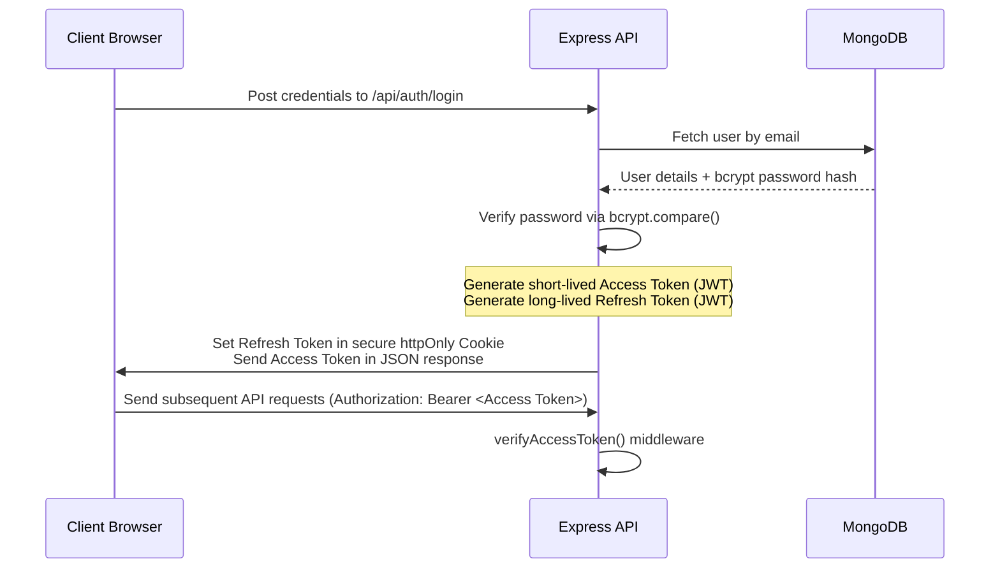

# ProjectNest - Architecture and Application Flow

This document details the internal systems, database schemas, real-time socket communications, and user flows that power ProjectNest.

---

## 1. Authentication & Authorization Flow

ProjectNest secures its APIs using JWT (JSON Web Tokens) with a short-lived Access Token and a long-lived Refresh Token.



### Key Security Practices
- **httpOnly Cookies**: Storing the refresh token in `httpOnly` cookies protects it from Cross-Site Scripting (XSS) attacks.
- **Short Token Lifespans**: Access tokens expire in 15 minutes, limiting the damage of token leakage.
- **Silent Re-authentication**: An interceptor on the frontend intercepts `401 Unauthorized` responses, calls the token refresh endpoint `/api/auth/refresh` to get a new access token, and retries the original request.
- **Email Verification**: During registration, an account is marked as `isVerified: false`. A verification token is generated, stored in the DB with an expiration, and emailed to the user via Nodemailer. Only verified users can access workspace APIs.

---

## 2. Database Design & Schemas

We define 16 distinct database collections using Mongoose schemas. Relationships are modeled using reference fields (`Schema.Types.ObjectId`) and populated dynamically.

### Collection Fields & Types

#### 1. Users
- `name` (String, required)
- `email` (String, required, unique, indexed)
- `passwordHash` (String, required)
- `avatarUrl` (String)
- `isVerified` (Boolean, default: `false`)
- `verificationToken` (String)
- `verificationTokenExpires` (Date)
- `resetPasswordToken` (String)
- `resetPasswordExpires` (Date)
- `role` (String: `Admin`, `Team Lead`, `Developer`, default: `Developer`)
- `status` (String: `online`, `offline`, `away`, default: `offline`)

#### 2. Workspaces
- `name` (String, required)
- `description` (String)
- `owner` (ObjectId -> Users)
- `members` (Array of objects: `{ userId: ObjectId -> Users, role: String ['Admin', 'Member'] }`)
- `inviteCode` (String, unique, indexed)

#### 3. Teams
- `workspaceId` (ObjectId -> Workspaces, required, indexed)
- `name` (String, required)
- `description` (String)
- `members` (Array of objects: `{ userId: ObjectId -> Users, role: String ['Lead', 'Member'] }`)

#### 4. Projects
- `workspaceId` (ObjectId -> Workspaces, required, indexed)
- `name` (String, required)
- `description` (String)
- `teamId` (ObjectId -> Teams, optional)
- `isArchived` (Boolean, default: `false`)

#### 5. ProjectMembers
- `projectId` (ObjectId -> Projects, required, indexed)
- `userId` (ObjectId -> Users, required)
- `role` (String: `Admin`, `Member`, `Viewer`, default: `Member`)

#### 6. Channels
- `workspaceId` (ObjectId -> Workspaces, required, indexed)
- `projectId` (ObjectId -> Projects, optional)
- `name` (String, required)
- `description` (String)
- `isPrivate` (Boolean, default: `false`)
- `members` (Array of ObjectId -> Users, optional)

#### 7. Messages
- `channelId` (ObjectId -> Channels, optional)
- `senderId` (ObjectId -> Users, required)
- `receiverId` (ObjectId -> Users, optional) (for DMs)
- `content` (String, required)
- `attachments` (Array of objects: `{ url: String, fileType: String, name: String }`)
- `reactions` (Array of objects: `{ userId: ObjectId -> Users, emoji: String }`)
- `replies` (Array of ObjectId -> Messages)
- `isPinned` (Boolean, default: `false`)
- `readBy` (Array of ObjectId -> Users)

#### 8. Tasks
- `projectId` (ObjectId -> Projects, required, indexed)
- `title` (String, required)
- `description` (String)
- `status` (String: `todo`, `in_progress`, `review`, `done`, default: `todo`)
- `priority` (String: `low`, `medium`, `high`, default: `medium`)
- `dueDate` (Date)
- `assignees` (Array of ObjectId -> Users)
- `labels` (Array of String)
- `attachments` (Array of String)
- `creatorId` (ObjectId -> Users, required)

#### 9. TaskComments
- `taskId` (ObjectId -> Tasks, required, indexed)
- `userId` (ObjectId -> Users, required)
- `content` (String, required)

#### 10. Notes
- `workspaceId` (ObjectId -> Workspaces, required, indexed)
- `projectId` (ObjectId -> Projects, optional)
- `userId` (ObjectId -> Users, required)
- `title` (String, required)
- `content` (String, default: "")
- `folder` (String, default: "General")

#### 11. Files
- `workspaceId` (ObjectId -> Workspaces, required, indexed)
- `projectId` (ObjectId -> Projects, optional)
- `uploadedBy` (ObjectId -> Users, required)
- `name` (String, required)
- `url` (String, required)
- `fileType` (String)
- `size` (Number)

#### 12. CodeSnippets
- `workspaceId` (ObjectId -> Workspaces, required, indexed)
- `userId` (ObjectId -> Users, required)
- `title` (String, required)
- `description` (String)
- `code` (String, required)
- `language` (String, default: "javascript")
- `likes` (Array of ObjectId -> Users)
- `bookmarks` (Array of ObjectId -> Users)

#### 13. Whiteboards
- `workspaceId` (ObjectId -> Workspaces, required, indexed)
- `projectId` (ObjectId -> Projects, optional)
- `title` (String, required)
- `elements` (Array, default: [])

#### 14. Notifications
- `userId` (ObjectId -> Users, required, indexed)
- `type` (String: `message`, `task_assigned`, `mention`, `system`)
- `title` (String, required)
- `message` (String, required)
- `isRead` (Boolean, default: `false`)
- `link` (String)

#### 15. Activities
- `workspaceId` (ObjectId -> Workspaces, required, indexed)
- `projectId` (ObjectId -> Projects, optional)
- `userId` (ObjectId -> Users, required)
- `action` (String, required)
- `details` (Object)

#### 16. Meetings
- `workspaceId` (ObjectId -> Workspaces, required, indexed)
- `title` (String, required)
- `description` (String)
- `startTime` (Date, required)
- `endTime` (Date, required)
- `link` (String)
- `attendees` (Array of ObjectId -> Users)

---

## 3. Socket.io Architecture & Event Routing

WebSocket communication provides real-time state synchronization across active developer teams. When a client establishes a connection, they undergo token authentication.

```text
       ┌──────────┐
       │  Client  │
       └────┬─────┘
            │
            ├─ 1. Connect and Auth (JWT via handshakes)
            │
            ├─ 2. Join Workspace Room (e.g. workspace:ws123)
            │
            ├─ 3. Join Project / Channel Rooms (e.g. channel:ch456)
            ▼
```

### Dynamic Room Memberships
1. **User Room (`user:<userId>`)**: Receives personal alerts (e.g., "You were assigned a task", direct messages).
2. **Workspace Room (`workspace:<workspaceId>`)**: Tracks online statuses, active users, and global announcements.
3. **Project Room (`project:<projectId>`)**: For live Kanban board modifications. If a user moves a card, all members on that project immediately view the card sliding to the new column.
4. **Channel Room (`channel:<channelId>`)**: Encapsulates active conversations. Distributes typing triggers, message reactions, and new chats.
5. **Whiteboard Room (`whiteboard:<whiteboardId>`)**: Syncs mouse/stylus positions and canvas adjustments in real-time.

### Event Definitions
- **Auth/Presence**: `connect`, `disconnect`, `typing`, `stopTyping`
- **Messages**: `sendMessage`, `receiveMessage`, `messageSeen`, `editMessage`, `deleteMessage`, `reactionAdded`
- **Kanban Board**: `taskCreated`, `taskUpdated`, `taskMoved`, `taskAssigned`
- **Whiteboard Sync**: `draw`, `erase`, `undo`, `redo`, `cursorMove`
- **Notifications**: `notification`, `activityCreated`

---

## 4. Application Flow

1. **Onboarding**: A user signs up, verifies their email, and either creates a new workspace or joins an existing one via an invite code.
2. **Workspace Setup**: Within a workspace, leads form teams and build projects.
3. **Communication**: Channels are generated automatically for projects or explicitly for team-wide chat. Users interact via Slack-like channels and private direct messages.
4. **Project Execution**: Boards are utilized to track milestones (Kanban drag-and-drop). Whiteboards (Excalidraw) and document notes (Markdown) allow team brainstorming and documentation.
5. **Developer Utilities**: Developers bookmark code snippets, leverage Monaco code editors, and make AI inquiries (Gemini API) to generate mockups, resolve compiler warnings, or document logic.

---

## 5. Phase 3 Authentication Specifications

### REST Endpoints
We expose a series of routes mapped to `/api/auth/*`:
* **`POST /register`**: Registers a new user. Salts and hashes passwords with `bcryptjs`. Generates a 24-hour verification token sent via email.
* **`POST /login`**: Validates credentials. Verifies that the email has been confirmed. Sets a long-lived (7-day) Refresh Token in an `httpOnly`, `sameSite: strict` secure cookie. Returns a short-lived (15-min) Access Token in the payload.
* **`POST /logout`**: Resets the online status and clears the refresh cookie.
* **`POST /refresh`**: Takes the HTTP-only cookie refresh token, verifies it, and returns a new Access Token.
* **`GET /verify-email/:token`**: Activates account on validation match.
* **`POST /forgot-password`**: Generates a 1-hour reset token and dispatches a recovery email.
* **`POST /reset-password/:token`**: Validates token and overrides the password.
* **`GET /profile`**: Fetches the authenticated user profile.
* **`PUT /profile`**: Updates name and role specifications.
* **`POST /profile/avatar`**: Processes multi-part image uploads via `multer` into a buffer stream, uploading to Cloudinary to update the user's `avatarUrl`.

### Socket Handshake Authorization
During socket connection setup, the client passes the JWT access token in the auth payload:
```javascript
const socket = io(SOCKET_URL, {
  auth: { token: localStorage.getItem('token') }
});
```
The server-side middleware `socketAuth` intercepts the connection, verifies the JWT, and binds the parsed details to `socket.user` so all downstream event listeners are context-aware. If verification fails, the connection is rejected.

---

## 6. Phase 4 Workspace Module Specifications

Workspaces partition the system to achieve multi-tenancy. Projects, chats, channels, boards, and files are contained within specific workspace boundaries.

### REST Endpoints
We expose a series of routes mapped to `/api/workspaces/*`:
* **`POST /`**: Creates a workspace, registers the creator as the Owner and an Admin. Generates an 8-character invite code.
* **`GET /`**: Lists all workspaces where the user is listed in the members array.
* **`POST /join`**: Registers a user to a workspace using their active `inviteCode`.
* **`GET /:id`**: Fetches detailed workspace metadata, listing populated users and status flags. (Requires Workspace Membership).
* **`PUT /:id`**: Updates the workspace's name and description parameters. (Requires Workspace Admin).
* **`DELETE /:id`**: Deletes the workspace database entries. (Requires Workspace Owner).
* **`POST /:id/invite`**: Regenerates a new 8-character invite code slug. (Requires Workspace Admin).
* **`POST /:id/leave`**: Removes the user from the workspace members list. Owners are blocked from leaving. (Requires Workspace Membership).

### Workspace Access Policies
Two custom authorization middlewares protect workspace endpoints:
1. **`isWorkspaceMember`**: Checks if the authenticated user (`req.user.id`) is a member of the requested workspace ID. Attaches the Mongoose document to `req.workspace` and the user's role to `req.workspaceRole`.
2. **`isWorkspaceAdmin`**: Requires `isWorkspaceMember` to have run. Checks if the user is the workspace `owner` or has the `'Admin'` role in the membership list.

---

## 7. Phase 5 Teams Module Specifications

Teams act as workspace subdivisions. They isolate developers to collaborate on targeted projects and channels.

### REST Endpoints
We expose a series of routes mapped to `/api/teams/*`:
* **`POST /`**: Creates a team. Registers the creator user as a `'Lead'`. (Requires Workspace Admin).
* **`GET /workspace/:workspaceId`**: Lists all teams registered inside a specific workspace. (Requires Workspace Membership).
* **`GET /:id`**: Fetches detailed team metadata, including members populated with statuses. (Requires Workspace Membership of parent workspace).
* **`PUT /:id`**: Modifies the team's name and description parameters. (Requires Team Lead or Workspace Admin).
* **`DELETE /:id`**: Deletes the team database entries. (Requires Team Lead or Workspace Admin).
* **`POST /:id/members`**: Registers a user into the team list with a selected role (`Lead`/`Member`). (Requires Team Lead or Workspace Admin, and target user must be a member of parent workspace).
* **`DELETE /:id/members/:userId`**: Removes a user from the team list. (Requires Team Lead or Workspace Admin).

### Team Access Policies
We define a custom middleware `isTeamLeadOrWorkspaceAdmin` that checks if the request user is either listed as a `'Lead'` inside the target team's membership array or possesses `'Admin'` status (or owns) the parent workspace. Only users passing this validation can add/remove members, update details, or delete teams.

---

## 8. Phase 6 Projects Module Specifications

Projects divide workspace structures into focused boards which house specific channels, whiteboards, and tasks.

### REST Endpoints
We expose a series of routes mapped to `/api/projects/*`:
* **`POST /`**: Creates a project. Registers the creator as a Project `'Admin'` in the `ProjectMembers` collection. Optional team linkage properties. (Requires Workspace Admin).
* **`GET /workspace/:workspaceId`**: Lists all projects registered inside a specific workspace. (Requires Workspace Membership).
* **`GET /:id`**: Fetches detailed project metadata and links a list of project memberships populated with roles and statuses. (Requires Project Membership or parent Workspace Admin).
* **`PUT /:id`**: Updates project name, description, and associated team properties. (Requires Project Admin).
* **`POST /:id/archive`**: Toggles project archived status. (Requires Project Admin).
* **`DELETE /:id`**: Deletes project metadata and clears the matching memberships list. (Requires Project Admin or Workspace Admin).
* **`POST /:id/members`**: Enrolls workspace developers to the project membership table with permissions (`Admin`, `Member`, `Viewer`). (Requires Project Admin).
* **`DELETE /:id/members/:userId`**: Removes members from the project enrollment sheet. (Requires Project Admin).

### Project Access Policies
Two custom authorization middlewares protect project endpoints:
1. **`isProjectMember`**: Checks if the authenticated user has a membership record inside `ProjectMembers` for the target project ID, or is a parent Workspace Admin/Owner. Attaches parsed objects to `req.project` and `req.projectMember`.
2. **`isProjectAdmin`**: Requires `isProjectMember` to have run. Verifies if the request user has the `'Admin'` role in the project members list or possesses `'Admin'` (or Owner) status in the parent workspace.

---

## 9. Phase 7 Real-Time Chat Module Specifications

The Chat Module incorporates both HTTP REST endpoints (for query history, settings updates, and multipart file transfers) and WebSockets (Socket.io) for real-time text delivery, typing indicators, read receipts, and user online status changes.

### REST Endpoints
We expose routes mapped to `/api/channels/*` and `/api/messages/*`:
* **`POST /api/channels`**: Creates a channel. (Requires Workspace Membership. For private channels, sets members list).
* **`GET /api/channels/workspace/:workspaceId`**: Lists all public channels and private channels where the request user is a member. (Requires Workspace Membership).
* **`GET /api/channels/:id`**: Fetches channel metadata populated with member lists. (Requires Channel Membership/Workspace Admin).
* **`POST /api/messages`**: Multipart upload endpoint. Processes attachments via Multer buffer arrays and stream-uploads them to Cloudinary. Supports `parentId` parameters to link thread replies.
* **`GET /api/messages/channel/:channelId`**: Fetches paginated history matching channel IDs, supporting RegExp search queries. (Requires Channel Membership).
* **`GET /api/messages/dm/:receiverId`**: Fetches paginated logs exchange between current user and target user.
* **`PUT /api/messages/:id`**: Modifies text content. (Restricted to message sender).
* **`DELETE /api/messages/:id`**: Erases message from DB. (Restricted to message sender or Workspace Admin).
* **`POST /api/messages/:id/pin`**: Toggles message pin state.
* **`POST /api/messages/:id/react`**: Adds or removes user emoji reactions.

### Socket.io Event Handling
WebSocket traffic is isolated into rooms:
1. **`user:<userId>`**: Receives personal notices and direct message payloads.
2. **`channel:<channelId>`**: Receives channel broadcasts.
3. **`dm:<senderId>-<receiverId>`** (or user notification rooms): Segmented DM delivery.

Socket listeners in `chatSocket.js` capture:
* **`joinConversation`** / **`leaveConversation`**: Joins/leaves target chat rooms.
* **`typing`** / **`stopTyping`**: Emits and debounces typing flags to the conversation room.
* **`sendMessage`**: Instantly saves text messages to MongoDB and emits `messageReceived` to the room.
* **`messageSeen`**: Appends user ID to message read receipts database log, broadcasting `messageSeenUpdated` to active clients.

---

## 10. Phase 8 Kanban Board Module Specifications

Kanban boards structure visual tasks inside projects. Boards partition tasks into columns, and cards manage detailed checklists, assignment tags, due dates, comment discussions, and historical timelines.

### REST Endpoints
We expose routes mapped to `/api/boards/*` and `/api/cards/*`:
* **`POST /api/boards`**: Creates a board. (Requires Workspace Membership. Defaults columns to `['To Do', 'In Progress', 'Done']`).
* **`GET /api/boards/project/:projectId`**: Lists all boards configured under a project. (Requires Workspace Membership).
* **`GET /api/boards/:id`**: Fetches board details and populates all cards sorted by position. (Requires Workspace Membership).
* **`PUT /api/boards/:id`**: Updates board name and column lists.
* **`DELETE /api/boards/:id`**: Erases board details and all its cards.
* **`POST /api/cards`**: Creates a task card inside a column with position calculations. Appends creation audit details to the activity log.
* **`GET /api/cards/:id`**: Fetches detailed card metadata, populated with assignees, comment owners, and activity log users.
* **`PUT /api/cards/:id`**: Updates card name, description, due date, or labels, appending logs to the audit history.
* **`PATCH /api/cards/:id/move`**: Updates card column and position, recording movement details.
* **`POST /api/cards/:id/assign`**: Toggles card assignees list, recording assignment audits.
* **`POST /api/cards/:id/comments`**: Appends task comments.
* **`DELETE /api/cards/:id/comments/:commentId`**: Deletes comments. (Restricted to comment owner or Admin).
* **`DELETE /api/cards/:id`**: Deletes task card.

### HTML5 Drag and Drop Interaction
Task movements are executed on the client using native HTML5 drag-and-drop triggers, enabling light execution with zero dependencies:
* Cards are declared with `draggable={true}` and export card IDs inside `onDragStart`.
* Column areas listen to `onDragOver` (accepting drop frames) and `onDrop` to capture card IDs, executing optimistic updates locally before saving state changes to the backend.

---

## 11. Phase 9 Document Editor & Collaborative Notes Specifications

The Document Notes Module combines HTTP REST endpoints (for creating documents, restoring version logs, and exports) with Socket.io web sockets for real-time collaborative text synchronizations.

### REST Endpoints
We expose routes mapped to `/api/documents/*`:
* **`POST /api/documents`**: Creates a document under a project. (Requires Workspace Membership. Sets creator as the author of the first history snapshot).
* **`GET /api/documents/project/:projectId`**: Lists all documents in a project context. (Requires Workspace Membership).
* **`GET /api/documents/:id`**: Fetches detailed document metadata, populated with historical versions and authors. (Requires Workspace Membership).
* **`POST /api/documents/:id/version`**: Saves a new version snapshot. Pushes a new entry to the `versions` array containing the timestamp, text, and author ObjectID.
* **`POST /api/documents/:id/restore`**: Restores the document's active text content to a specific historical snapshot.
* **`DELETE /api/documents/:id`**: Erases the document from the database (restricted to project Admins).

### Live Collaborative Sockets
When editing, clients establish real-time connections via websocket events:
1. **`joinDocument`** / **`leaveDocument`**: Joins or leaves room named `document:<documentId>`. Emits `documentCollaboratorJoined` / `documentCollaboratorLeft` to list active editors in a toolbar user status list.
2. **`documentEdit`**: Listens for local keyboard events. Emits the current document text content and active title.
3. **`documentUpdate`**: Broadcasts content modifications to other active editors, updating their editor viewport canvases in real-time.

### Markdown & PDF Export Configurations
* **Custom Markdown Compiler**: A regex-based lightweight compiler dynamically parses headers (`#`, `##`, `###`), lists (`*`, `-`), bold text (`**`), inline code (` ` `), blockquotes (`>`), and code blocks (```) to HTML markup, rendered in the client split preview canvas.
* **Natively Structured Printing**: Uses browser-native printing actions (`window.print()`). The stylesheet defines `@media print` rules to automatically hide sidebars, header toolbars, and cursor overlays, producing a clean formatted PDF layout directly from the preview pane.

---

## 12. Phase 10 Code Sandbox & Excalidraw Collaborative Whiteboard Specifications

The Sandbox & Whiteboard module enables real-time visual collaboration alongside structured code execution consoles.

### REST Endpoints
We expose routes mapped to `/api/drawings/*`:
* **`POST /api/drawings`**: Creates a blackboard sketch. (Requires Workspace Membership).
* **`GET /api/drawings/project/:projectId`**: Lists drawings configured under a project. (Requires Workspace Membership).
* **`GET /api/drawings/:id`**: Fetches Excalidraw element coordinates and scene states.
* **`PUT /api/drawings/:id`**: Saves element changes to MongoDB.
* **`DELETE /api/drawings/:id`**: Deletes whiteboard files.

### Collaborative Sockets
Real-time drawing strokes are coordinated via Socket.io:
* **`joinWhiteboard`** / **`leaveWhiteboard`**: Joins or leaves room named `whiteboard:<drawingId>`.
* **`whiteboardEdit`**: Fired on Excalidraw modifications. Transmits canvas elements list.
* **`whiteboardUpdate`**: Broadcasts elements list to other drawers inside the room, allowing real-time collaborative sketch rendering.

### Sandboxed Code Execution
* **Monaco Editor Panel**: Embeds Monaco code sheets supporting auto-completions, syntax highlights, and active tabs for HTML, CSS, JavaScript, and Python.
* **Web Rendering Frame**: Combines HTML, CSS, and JS editor inputs and mounts them inside an `iframe` sandbox configured with `srcDoc` parameters. Captures logs or errors and formats them into a clean console logs panel.
* **Script Interpretations**: Runs JS evaluations via indirect `(0, eval)` to prevent bundler warnings. Runs simulated Python script compilers to execute code commands and output logs inside a terminal display.

---

## 13. Phase 11 AI Copilot & Chatbot Module Specifications

The AI Copilot module handles structured assistant dialogues populated with contextual project awareness.

### REST Endpoints
We expose routes mapped to `/api/ai/*`:
* **`POST /api/ai/chat`**: Accepts active conversation history, prompts parameters, and model targets. Queries Gemini/Claude/GPT endpoints and saves message sequences to the database.
* **`POST /api/ai/complete`**: Fetches autocomplete suggestions matching code prefix text.
* **`GET /api/ai/history`**: Lists the active user's past AI chat logs.
* **`GET /api/ai/history/:id`**: Fetches detailed message transcripts for a chat session.
* **`DELETE /api/ai/history/:id`**: Erases the AI chat log.

### AI Engine Configurations & Context Awareness
* **Model Routing logic**: Supports Google Gemini, Anthropic Claude, and OpenAI GPT. Reads environment parameters (`GEMINI_API_KEY`, `OPENAI_API_KEY`, `ANTHROPIC_API_KEY`) to issue actual network request payloads. If API keys are missing, the service falls back to high-fidelity, mock response transcripts.
* **Project Awareness Context**: When a user messages from a project context, the backend queries parent project metadata, active Kanban tasks list, and project document notes. It appends these records as system prompts, allowing the AI to summarize project status and recommend specific sprint coordinates.
* **Prompt Shortcut Cards**: Client layouts offer quick prompt shortcut cards ("Explain Code Layout", "Find Staging Bugs", "Recommend Tasks") that pre-populate prompts inside the editor chat bar to simplify brainstorming.

---

## 14. Phase 12 Production Verification & Deployment Specifications

The production deployment architecture covers clustering operations, environment controls, and raw virtual machine boots.

### Security Audits
* **HTTP Headers Guard**: Installs `helmet` to manage standard browser header security tokens (such as Clickjacking frameguards, X-Content-Type-Options cross-mime parameters, and cross-site scripting protections).
* **Cross-Origin Resource Sharing**: CORS parameters lock resource requests to permitted domain registries (`CLIENT_URL` settings).

### Process Management & Clustering
* **CPU Auto-scaling**: We configure `ecosystem.config.cjs` using PM2 cluster mode to fork API worker threads matching CPU cores count.
* **Autorestart & Health**: Integrates memory cap limits to restart worker sub-nodes dynamically on leaks, routing logs to historical audit log folders.

### Root-Level Bootstrapping Automations
* **Root Script Runner**: Configures a root-level `package.json` with scripts to install dependencies and compile client static assets inside a single terminal execution.

### CI/CD Workflow Automations
* **Build Verification Pipelines**: Executes GitHub Actions to compile frontend assets and verify server syntax health automatically on main pushes.

---

## 15. Phase 13 Workspace Dashboard Summary & Statistics Specifications

The dashboard acts as the landing hub of ProjectNest, consolidating developer metrics from different database collections.

### REST Endpoints
We expose routes mapped to `/api/workspaces/:id/stats`:
* **`GET /api/workspaces/:id/stats`**: Aggregates projects count, teams count, workspace members count, and task counts. Queries documents and drawings to compile lists of recent updates.

### Stats Aggregations & Dashboard Redesigns
* **Aggregation Pipelines**: Utilizes standard Mongoose collections filters to fetch:
  - `projectsCount`: total projects matching workspace reference.
  - `teamsCount`: total teams matching workspace reference.
  - `tasksProgress`: completion rate calculation `(completed / total) * 100`% over active card lists.
* **Premium Dashboard UX**: Displays metrics counts inside gradient border widgets, task completeness rates in interactive progress bars, and recent document/whiteboard sketches logs linked to direct workspace pages.


